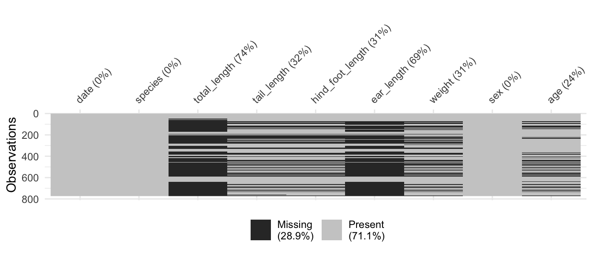
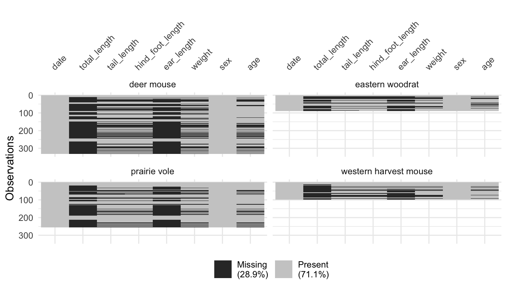
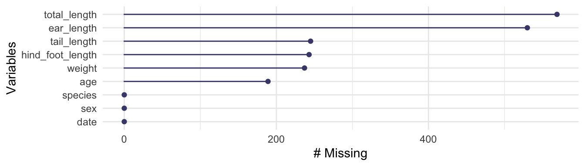
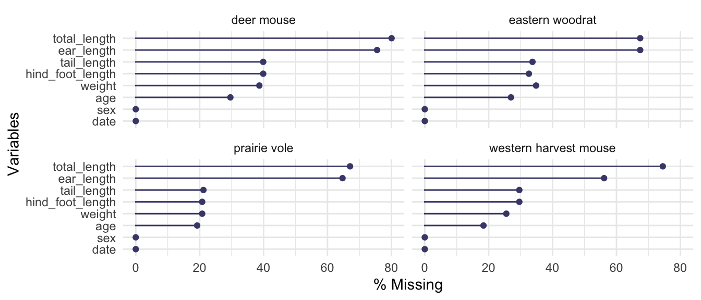
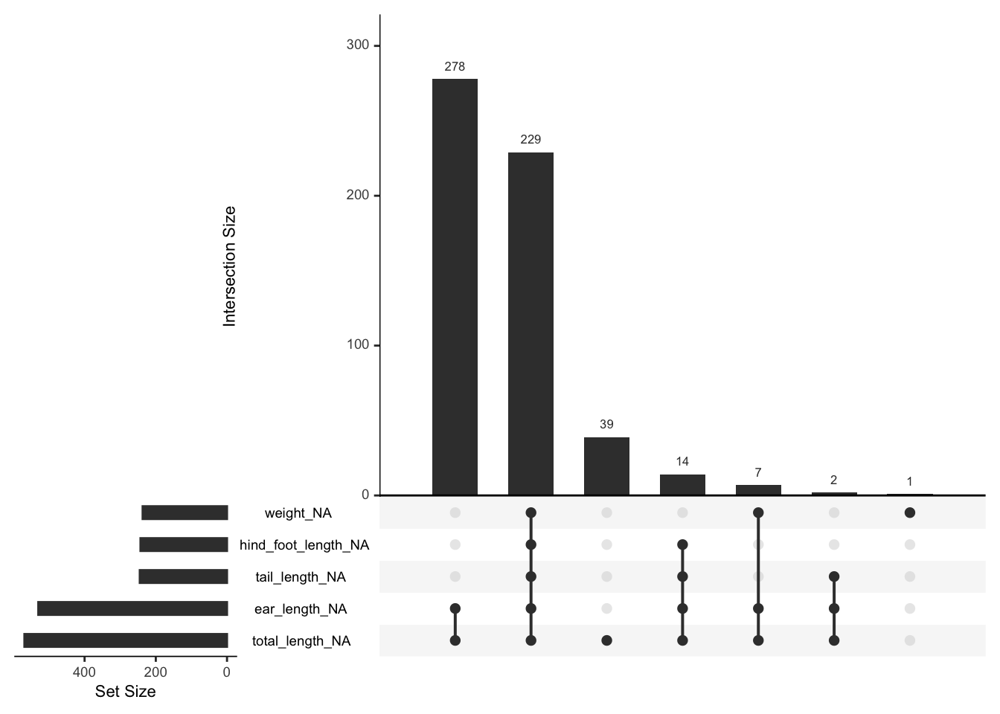
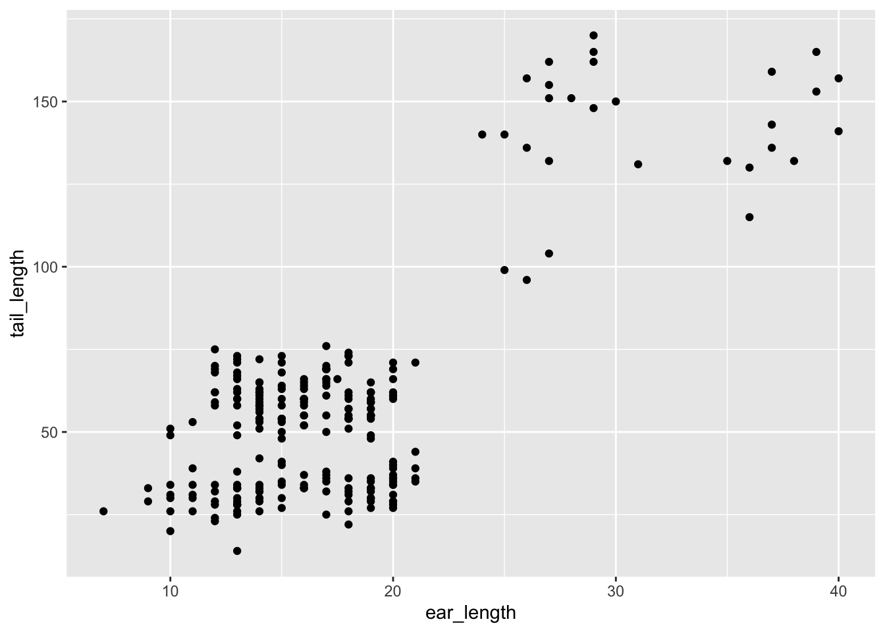
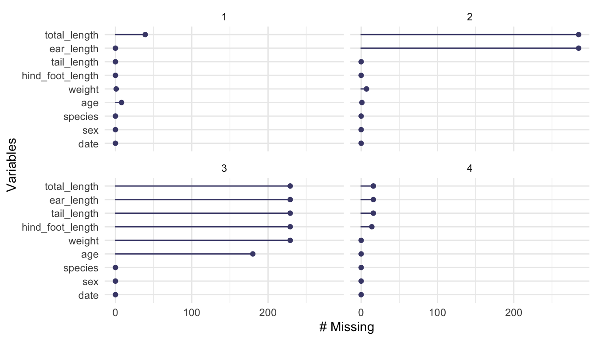
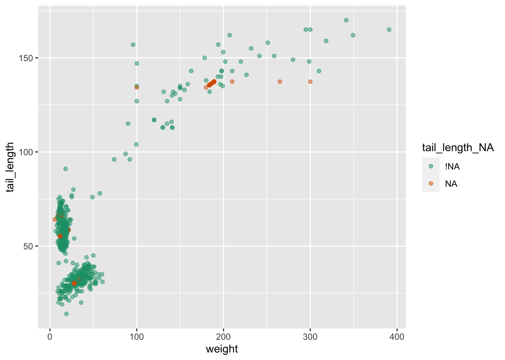
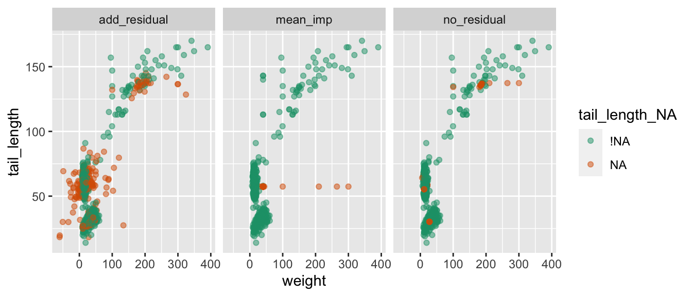

# Some ideas for exploring missing data

Nicholas Tierney

Infectious Disease Ecology and Modelling group

Telethon Kids Institute, Perth, WA, Australia

``` r
library(tidyverse)
library(visdat)
library(naniar)
```

# Introduction

When you do data analysis, you come across missing data. Because I felt
so frustrated by how hard it was to handle and wrangle missing data, I
wanted to make it easier. In my endeavours I have written two R
packages, `visdat` and `naniar`, for exploring missing data, and several
papers on the topic.

The goal of this article is to share some condensed ideas on exploring
missing data, using `naniar`, and `visdat`. To that end, we will focus
on four questions.

1.  How do we start looking at missing data?
2.  How do we explore missingness in variables?
3.  How do we explore missingness relationships?
4.  How do we explore imputed values?

But first, let’s introduce ourselves to the data.

# The data

The data used for this paper is measurements of rodents in Kansas, from
Hope (2023). The use of this data is inspired by Allison Horst’s
“Exploring missing values in naniar” [shiny
application](https://allisonhorst.shinyapps.io/missingexplorer/). In
this paper we use a different, larger set of the data. For information
on the metadata of the paper see
[here](http://lter.konza.ksu.edu/content/csm08-small-mammal-host-parasite-sampling-data-16-linear-trapping-transects-located-8-lter).
The data set provides various biometric length and weight measurements,
for four species of rodents: the Eastern woodrat, Prairie vole, Western
harvest mouse, and Deer mouse. Table **?@tbl-rodents-slice** shows a
snapshot of 6 selected rows of the data, which shows some of the
missingness.

<div __quarto_custom_scaffold="true">

<div class="cell-output-display">

| species               | total_length | tail_length | hind_foot_length | ear_length | weight | sex | age |
|:----------------------|-------------:|------------:|-----------------:|-----------:|-------:|:----|:----|
| prairie vole          |           NA |          32 |               20 |         NA |   30.0 | F   | A   |
| deer mouse            |           NA |          62 |               19 |         NA |   17.5 | F   | A   |
| western harvest mouse |           NA |          NA |               NA |         NA |     NA | N   | NA  |
| western harvest mouse |           NA |          NA |               NA |         NA |     NA | N   | NA  |
| prairie vole          |           NA |          NA |               NA |         NA |     NA | N   | NA  |
| prairie vole          |           NA |          26 |               18 |         NA |   18.0 | M   | Juv |

</div>

</div>

<div __quarto_custom_scaffold="true">

The rodents dataset, containing measurements of various rodents,
including: total length - from tail to nose, tail length, hind foot
length, ear length, and weight. Each row represents a measurement of a
given species of roden at a particular date. There are missing values.

</div>

# How do we start looking at missing data?

To get an overview of the missing data, we can use the `visdat` package
(Tierney 2017), which was inspired by the work in
[`csv-fingerprint`](https://setosa.io/blog/2014/08/03/csv-fingerprints/),
and functions like `missmap`, from `Amelia` (Honaker, King, and
Blackwell 2011). The key function for exploring missingness is
`vis_miss()`, which visualises the missingness of a whole dataframe.
<a href="#fig-vis-miss" class="quarto-xref">Figure 1</a> gives an
example where it displays the data as missing, or not missing, and
provides information on the amount of missings in each column.

``` r
vis_miss(rodents)
```



We learn there is nearly 29% missing data overall, the missing data
occurs in `total_length`, `tail_length`, `hind_foot_length`,
`ear_length`, `weight`, and `age`, and mostly in `total_length` and
`ear_length`.

## Exploring subgroups: Using facetting in visdat

To see this plot split up by species, we can split up the `vis_miss`
plots into several facetted plots via the `facet` argument. For example,
in <a href="#fig-vis-miss-facet" class="quarto-xref">Figure 2</a> we
facet by the `species` variable. Visually, it appears that the
missingness occurs in each species at roughly the same rate.

``` r
vis_miss(rodents, facet = species) 
```



There are other functions in the visdat package that focus on other
types of data, for example, `vis_value()`, `vis_binary()`, and
`vis_compare()`. To read more about the functions available in `visdat`
see the vignette [“Using
visdat”](https://CRAN.R-project.org/package=visdat/vignettes/using_visdat.html).

# How do we explore missingness in variables?

The `visdat` package provides overviews of data, whereas `naniar`
provides a more comprehensive set of tools for missing data.

## Numerical summaries of missing values

Two convenient counters of complete values and missings are `n_miss()`
and `n_complete()`. These work on both data frames and vectors, similar
to `dplyr::n_distinct()`

``` r
dplyr::n_distinct(rodents)
```

    [1] 617

``` r
dplyr::n_distinct(rodents$tail_length)
```

    [1] 96

``` r
n_miss(rodents)
```

    [1] 2013

``` r
n_miss(rodents$tail_length)
```

    [1] 245

``` r
n_complete(rodents)
```

    [1] 4944

``` r
n_complete(rodents$tail_length)
```

    [1] 528

The functions `prop_miss_case()` and `pct_miss_case()` return numeric
value describing the proportion or percent of missing values in the
dataframe.

``` r
prop_miss_case(rodents)
```

    [1] 0.7477361

``` r
pct_miss_case(rodents)
```

    [1] 74.77361

Similar to `pct_miss_case()`, `prop_miss_case()`, `pct_miss_var()` and
`prop_miss_var()` returns the percent and proportion of variables that
contain a missing value.

``` r
prop_miss_var(rodents)
```

    [1] 0.6666667

``` r
pct_miss_var(rodents)
```

    [1] 66.66667

The syntax for the other numerical summaries in `naniar` are `miss_`,
and then `case`, or `var` to refer to cases or variables. There are then
`summary`, `table` suffixes. For example, the `miss_case_summary()`
function returns a numeric value that describes the number of missings
in a given case (aka row), the percent of missings in that row.

``` r
miss_case_summary(rodents) |> head()
```

    # A tibble: 6 × 3
       case n_miss pct_miss
      <int>  <int>    <dbl>
    1    63      6     66.7
    2    74      6     66.7
    3    77      6     66.7
    4    78      6     66.7
    5    79      6     66.7
    6    91      6     66.7

The `miss_case_table()` function tabulates the number of missing values
in a case / row. Below, this shows the number of missings in a case:

``` r
miss_case_table(rodents)
```

    # A tibble: 7 × 3
      n_miss_in_case n_cases pct_cases
               <int>   <int>     <dbl>
    1              0     195     25.2 
    2              1      48      6.21
    3              2     277     35.8 
    4              3      10      1.29
    5              4      14      1.81
    6              5      49      6.34
    7              6     180     23.3 

We can interpret this output as follows:

- 195 cases with 0 missings, which comprises about 25% of the data,
- 48 cases with 1 missing, these make up 6% of the data,
- 277 cases with 2 missing, these make up 35% of the data,
- and so on.

`miss_var_summary()` returns the number of missing values in a variable,
and the percent missing in that variable.

``` r
miss_var_summary(rodents)
```

    # A tibble: 9 × 3
      variable         n_miss pct_miss
      <chr>             <int>    <dbl>
    1 total_length        569     73.6
    2 ear_length          530     68.6
    3 tail_length         245     31.7
    4 hind_foot_length    243     31.4
    5 weight              237     30.7
    6 age                 189     24.5
    7 date                  0      0  
    8 species               0      0  
    9 sex                   0      0  

Finally, the `miss_var_table()` function describes the number of
missings in a variable:

``` r
miss_var_table(rodents)
```

    # A tibble: 7 × 3
      n_miss_in_var n_vars pct_vars
              <int>  <int>    <dbl>
    1             0      3     33.3
    2           189      1     11.1
    3           237      1     11.1
    4           243      1     11.1
    5           245      1     11.1
    6           530      1     11.1
    7           569      1     11.1

We can interpret this as there being:

- 3 variables with 0 missings, comprising 33% of variables in the
  dataset, and
- in the remaining variables similar patterns of missings, but not the
  exact same number of missing values.

## Visualise missingness in variables

To specifically focus on the number or proportion of missings in each
variable, we can use `gg_miss_var()`, as seen in
<a href="#fig-gg-miss-var" class="quarto-xref">Figure 3</a>.

``` r
gg_miss_var(rodents)
```



This displays the number of missing values in each variable. We learn
similar information to
<a href="#fig-vis-miss" class="quarto-xref">Figure 1</a>: total length,
and ear length have the most missing values, followed by tail length,
hind foot length, weight, and age. Just like with `vis_miss()`, we can
add in facets in these plots, via the `facet` argument, see
<a href="#fig-gg-miss-var-facet" class="quarto-xref">Figure 4</a>. We
learn again, that the species have similar amounts of missing data in
their variables. Sometimes it is useful to confirms the same piece of
information!

``` r
gg_miss_var(rodents, facet = species, show_pct = TRUE)
```



It feels like there are several patterns with the missingness - some
variables tend to go missing at the same time. To explore these patterns
we can use `gg_miss_upset()`, which produces an “upset” plot of the
intersecting sets of missingness (Conway, Lex, and Gehlenborg 2017).
This can be thought of as a generalised way to visualise intersecting
Venn diagrams.

``` r
gg_miss_upset(rodents)
```



There are more visualisations available in `naniar` (each starting with
`gg_miss_`) - you can see these in the [“Gallery of Missing Data
Visualisations”
vignette](https://cran.r-project.org/package=naniar/vignettes/naniar-visualisation.html).
Most plots created with the `gg_miss` family all have a basic theme
(except for `gg_miss_upset()`), but you can customise them by adding
components like a standard ggplot object:

``` r
gg_miss_var(rodents) + 
  theme_bw() + 
  labs(y = "Number of missing observations")
```

It is also worth noting that for every visualisation of missing data in
`naniar`, there is an accompanying function to extract the data used in
the plot. This is important as the plot should not return a dataframe -
but we want to make the data available for use by the user so it isn’t
locked into a plot.

For example, `miss_var_summary()` provides the dataframe that
`gg_miss_var()` is based on.

``` r
miss_var_summary(rodents)
```

    # A tibble: 9 × 3
      variable         n_miss pct_miss
      <chr>             <int>    <dbl>
    1 total_length        569     73.6
    2 ear_length          530     68.6
    3 tail_length         245     31.7
    4 hind_foot_length    243     31.4
    5 weight              237     30.7
    6 age                 189     24.5
    7 date                  0      0  
    8 species               0      0  
    9 sex                   0      0  

Which also works with `group_by()`:

``` r
rodents %>% 
  group_by(species) %>% 
  miss_var_summary()
```

Similarly, there is a `data_vis_miss()` function in the `visdat`
package, which returns the data in the format that this visualisation
requires.

``` r
data_vis_miss(rodents)
```

The aim of these is to provide the data required to make these
visualisations, so if people want to create their own more customised
versions of `vis_miss()` or `gg_miss_var()` then they can do that.

# How to explore missingness relationships?

We can identify key missing variables using `vis_miss()`,
`gg_miss_var()`, and `gg_miss_upset()`, but for further exploration, we
need to explore the relationship amongst the variables in this data:

- date
- species
- total_length
- tail_length
- hind_foot_length
- ear_length
- weight
- sex
- age

## Exploring using bivariate plots

Let’s say that we want to explore the relationship between tail length
and ear length.
<a href="#fig-example-geom-point" class="quarto-xref">Figure 6</a> shows
a scatter plot of tail length and ear length.

``` r
library(ggplot2)
ggplot(rodents, 
       aes(x = ear_length, 
           y = tail_length)) + 
  geom_point()
```



The problem with this is ggplot removes the missing values. This makes
them hard to explore. We can impute missings with values 10% lower than
the minimum value in that variable, which puts these values in a margin
area on the graphic. This method comes from
[`ggobi`](https://en.wikipedia.org/wiki/GGobi) (Cook and Swayne 2007),
and [`manet`](http://www.rosuda.org/MANET/) (Unwin et al. 1996).

This imputation is wrapped up in the `geom_miss_point()` ggplot2 geom.
<a href="#fig-geom-miss-point" class="quarto-xref">Figure 7</a>
illustrates this by exploring the relationship between tail length and
ear length from the rodents dataset.

``` r
ggplot(rodents, 
       aes(x = ear_length, 
           y = tail_length)) + 
  geom_miss_point() + 
  scale_colour_brewer(palette = "Dark2")
```


Being a proper ggplot geom, it supports all of the standard features of
ggplot2, such as **facets** and **themes** as shown in the code below
(output suppressed for brevity).

``` r
ggplot(rodents, 
       aes(x = ear_length, 
           y = tail_length)) + 
  geom_miss_point() + 
  facet_wrap(~species) + 
  theme_dark()
```

## Exploring using modelling

As evidenced by
<a href="#fig-gg-miss-upset" class="quarto-xref">Figure 5</a>, there is
a structure in the missingness in the rodents data. We can perform some
basic clustering on the missingness and then and learn which variables
and their values predict these missingness groups using decision trees
(Tierney et al. 2015; Barnett et al. 2017). We start by adding
missingness clusters, choosing four based on
<a href="#fig-gg-miss-upset" class="quarto-xref">Figure 5</a>. We
encourage exploring different numbers of clusters. We can then confirm
this pattern using visualisations.

``` r
rodents_miss_clust <- rodents %>% add_miss_cluster(n_clusters = 4)
gg_miss_var(rodents_miss_clust, facet = miss_cluster)
```

<figure>

<figcaption aria-hidden="true">Number of missings for each variable for
each cluster. We see clear patterns emerge where there are two variables
missing in cluster two, six variables missing in cluster three, and not
as many missings in clusters one and four.</figcaption>
</figure>

We use the R package `rpart` (Therneau and Atkinson 2023) to fit a
classification and regression tree (CART) to the data using all
variables.

``` r
library(rpart)
rodent_miss_cart <- rpart(
  factor(miss_cluster) ~ ., 
  data = rodents_miss_clust
  )
```

Variable importance scores (**?@tbl-var-imp**) reveal the most important
variables for predicting missingness cluster are date and sex.

<div __quarto_custom_scaffold="true">

<div class="cell-output-display">

| variable         | importance |
|:-----------------|-----------:|
| date             |     221.39 |
| sex              |     167.96 |
| hind_foot_length |      20.28 |
| age              |      15.08 |
| species          |      10.67 |
| tail_length      |       7.37 |
| weight           |       5.18 |

</div>

</div>

<div __quarto_custom_scaffold="true">

Variable importance scores for predicting missingness cluster. The most
important variables are date and sex.

</div>

To better understand these relationships, we would recommend exploring
using partial dependence plots using packages such as `vip` (Greenwell
and Boehmke 2020) and other decision tree plots using `rpart.plot`
(Milborrow 2022).

# How do we explore imputed values?

The [`simputation`](https://cran.r-project.org/package=simputation)
package provides a nice interface to imputation. We will impute values
for tail_length using the `impute_lm()` function, then visualise the
data, as seen in
<a href="#fig-simpute-invisible" class="quarto-xref">Figure 8</a>.

``` r
library(simputation)
library(dplyr)

rodents %>%
  impute_lm(tail_length ~ species + age) %>%
  ggplot(aes(x = weight,
             y = tail_length)) + 
  geom_point()
```

    Warning: Removed 237 rows containing missing values (`geom_point()`).


We don’t get any warnings regarding missing observations - because they
are all imputed! However this comes at a cost: we don’t know where the
imputations are - they are now sort of invisible.

We can track a copy of the missing data locations by using the function
`nabular()`, which binds another dataset to the current one which notes
the locations of the missing data. “Nabular” data is a really important
idea in `naniar`, but to keep it brief, for each column with missing
values, a new column is created to help identify misingness. For
example, a new column called `ear_length_NA` is created:

``` r
nabular(rodents) |> 
  select(starts_with("ear_length")) |> 
  head()
```

    # A tibble: 6 × 2
      ear_length ear_length_NA
           <dbl> <fct>        
    1         39 !NA          
    2         18 !NA          
    3         17 !NA          
    4         21 !NA          
    5         19 !NA          
    6         19 !NA          

The key takeaway here is there is now a copy of the data bound to it,
with each column ending in `_NA`, and the values either being “NA” for
missing, or “!NA” for not missing. For more details on the ideas
underlying this, and the benefits, we recommend reading our paper,
“Expanding Tidy Data Principles to Facilitate Missing Data Exploration,
Visualization and Assessment of Imputations” (Tierney and Cook 2023).

Using the shadow matrix to keep track of where the missings are, you can
actually keep track of the imputations, colouring by what was previously
missing in tail_length. For example, let’s create the nabular data, then
impute the data using a random forst, and plot it in
<a href="#fig-simpute-visible-lm" class="quarto-xref">Figure 9</a>.

``` r
rodents_nabular <- rodents %>%
  nabular() %>% 
  as.data.frame()

rodents_lm_tail_imputed <- rodents_nabular %>% 
  impute_lm(tail_length ~ species + date) %>% 
  impute_lm(weight ~ tail_length + species + date)

ggplot(rodents_lm_tail_imputed,
         aes(x = weight,
             y = tail_length,
             colour = tail_length_NA)) + 
  geom_point(alpha = 0.5) + 
  scale_colour_brewer(palette = "Dark2")
```



The `simputation` package has a nice option to add residual noise to the
imputations - in this case we can add some normal noise to the
observations, where the residuals are draws with replacement from the
model residuals. This gives us much greater variation in the
imputations. For comparison to other naive approaches, we will also add
mean imputation for comparison

Importantly, we can actually compare the two methods as below. This
first imputes the data using the residual method, then rowbinds the two
datasets together, creating a column called “imputation_type”, which
records which type of imputation was used, either “add_residual” or
“no_residual”:

``` r
rodents_lm_tail_imputed_res <- rodents_nabular %>% 
  impute_lm(tail_length ~ species + date, add_residual = "observed") %>% 
  impute_lm(weight ~ tail_length + species + date, add_residual = "observed")

rodents_mean_imputed <- rodents %>%
  nabular() %>% 
  as.data.frame() %>% 
  impute_mean_all()

rodents_imputed_comparison <- bind_rows(
  add_residual = rodents_lm_tail_imputed_res,
  no_residual = rodents_lm_tail_imputed,
  mean_imp = rodents_mean_imputed,
  .id = "imputation_type"
) %>% as_tibble()
```

We can see see the two different imputation methods side by side in
<a href="#fig-imputed-comparison" class="quarto-xref">Figure 10</a>.

``` r
ggplot(rodents_imputed_comparison,
         aes(x = weight,
             y = tail_length,
             colour = tail_length_NA)) + 
  geom_point(alpha = 0.5) + 
  scale_colour_brewer(palette = "Dark2") + 
  facet_wrap(~imputation_type)
```



# Conclusion

In this software corner we have demonstrated the use of the `visdat` and
`naniar` R packages for exploring and understanding missing data.

# References

<div id="refs" class="references csl-bib-body hanging-indent"
entry-spacing="0">

<div id="ref-Barnett2017" class="csl-entry">

Barnett, Adrian G., Paul McElwee, Andrea Nathan, Nicola W. Burton, and
Gavin Turrell. 2017. “Identifying Patterns of Item Missing Survey Data
Using Latent Groups: An Observational Study.” *BMJ Open* 7 (10):
e017284. <https://doi.org/10.1136/bmjopen-2017-017284>.

</div>

<div id="ref-Conway2017" class="csl-entry">

Conway, Jake R., Alexander Lex, and Nils Gehlenborg. 2017. “UpSetR: An R
Package for the Visualization of Intersecting Sets and Their
Properties.” *Bioinformatics (Oxford, England)* 33 (18): 2938–40.
<https://doi.org/10.1093/bioinformatics/btx364>.

</div>

<div id="ref-Cook2007" class="csl-entry">

Cook, Dianne, and Deborah F. Swayne. 2007. *Interactive and Dynamic
Graphics for Data Analysis: With and *. Use R! New York: Springer.
<https://doi.org/10.1007/978-0-387-71762-3>.

</div>

<div id="ref-vip" class="csl-entry">

Greenwell, Brandon M., and Bradley C. Boehmke. 2020. “Variable
Importance Plots—an Introduction to the Vip Package.” *The R Journal* 12
(1): 343–66. <https://doi.org/10.32614/RJ-2020-013>.

</div>

<div id="ref-amelia" class="csl-entry">

Honaker, James, Gary King, and Matthew Blackwell. 2011. “Amelia II: A
Program for Missing Data.” *Journal of Statistical Software* 45 (1):
1–47. <https://doi.org/10.18637/jss.v045.i07>.

</div>

<div id="ref-hope2023" class="csl-entry">

Hope, Andrew. 2023. “CSM08 Small Mammal Host-Parasite Sampling Data for
16 Linear Trapping Transects Located in 8 LTER Burn Treatment Watersheds
at Konza Prairie.” Environmental Data Initiative.
<https://doi.org/10.6073/PASTA/F7BFB7226B093C817DC391C34A88B514>.

</div>

<div id="ref-rpart.plot" class="csl-entry">

Milborrow, Stephen. 2022. *Rpart.plot: Plot ’Rpart’ Models: An Enhanced
Version of ’Plot.rpart’*.
<https://CRAN.R-project.org/package=rpart.plot>.

</div>

<div id="ref-rpart" class="csl-entry">

Therneau, Terry, and Beth Atkinson. 2023. *Rpart: Recursive Partitioning
and Regression Trees*. <https://CRAN.R-project.org/package=rpart>.

</div>

<div id="ref-visdat" class="csl-entry">

Tierney, Nicholas. 2017. “<span class="nocase">visdat</span>:
Visualising Whole Data Frames.” *The Journal of Open Source Software* 2
(16): 355. <https://doi.org/10.21105/joss.00355>.

</div>

<div id="ref-Tierney2023" class="csl-entry">

Tierney, Nicholas, and Dianne Cook. 2023. “Expanding Tidy Data
Principles to Facilitate Missing Data Exploration, Visualization and
Assessment of Imputations.” *Journal of Statistical Software* 105 (7):
1–31. <https://doi.org/10.18637/jss.v105.i07>.

</div>

<div id="ref-Tierney2015" class="csl-entry">

Tierney, Nicholas, Fiona A. Harden, Maurice J. Harden, and Kerrie L.
Mengersen. 2015. “Using Decision Trees to Understand Structure in
Missing Data.” *BMJ Open* 5 (6): e007450.
<https://doi.org/10.1136/bmjopen-2014-007450>.

</div>

<div id="ref-Unwin1996" class="csl-entry">

Unwin, Antony, George Hawkins, Heike Hofmann, and Bernd Siegl. 1996.
“Interactive Graphics for Data Sets with Missing Values—MANET.” *Journal
of Computational and Graphical Statistics* 5 (2): 113–22.
<https://doi.org/10.1080/10618600.1996.10474700>.

</div>

</div>
